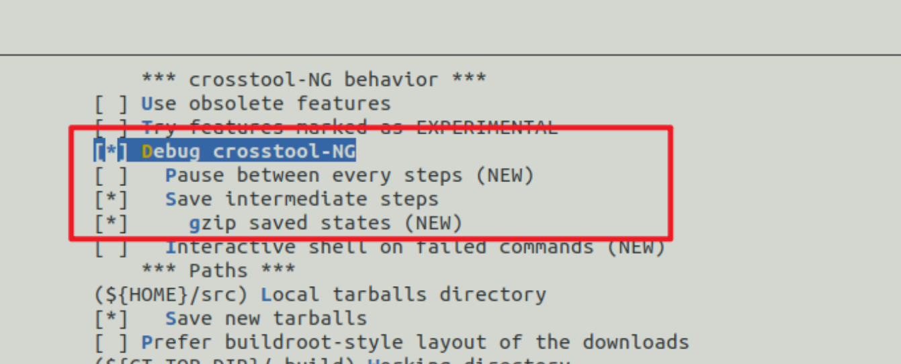
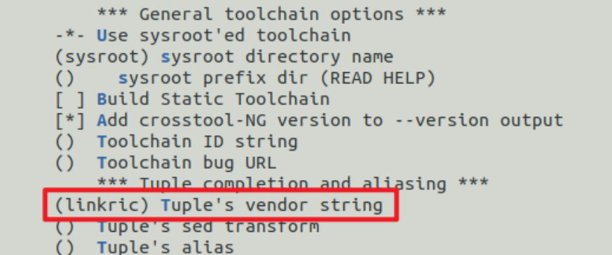
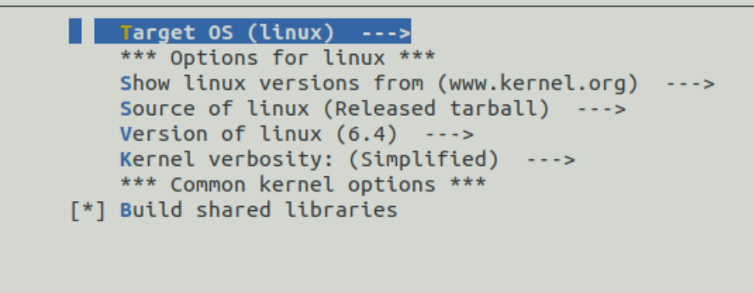
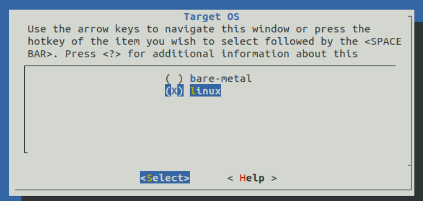
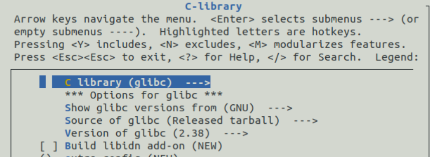
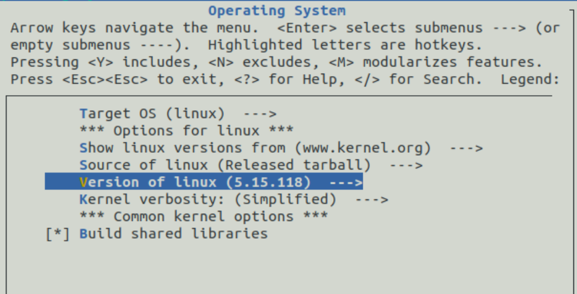
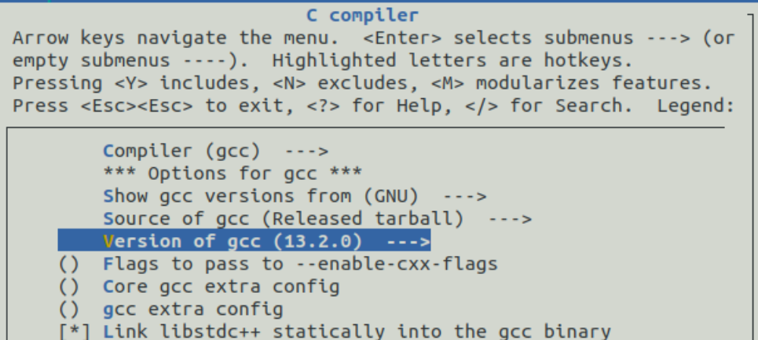
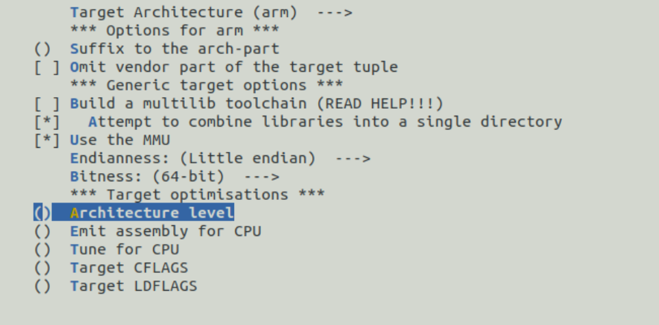

# cross-ng基础入门

## 简介

**crosstool-NG** aims at building toolchains

## 相关文档

[cross-ng github docs](https://crosstool-ng.github.io/docs/)

## 下载，安装

host主机把这些装上：

```bash
sudo apt-get install -y gcc g++ gperf bison flex texinfo help2man make libncurses5-dev \
    python3-dev autoconf automake libtool libtool-bin gawk wget bzip2 xz-utils unzip \
    patch libstdc++6 rsync git meson ninja-build
```

把库拉下来：

```bash
https://github.com/crosstool-ng/crosstool-ng/releases/tag/crosstool-ng-1.26.0
```

解压，进入安装包内部，执行：

```bash
./configure --prefix=/some/place
make
make install
export PATH="${PATH}:/some/place/bin"
```

可以执行以下指令来验证是否安装成功：

```bash
ct-ng help
```

## 配置CT-NG

编译工具链之前，可以用一下命令进行配置：

```bash
ct-ng menuconfig
```

配置内容丰富多样，比如说：

- 编译工具链的方式
- 工具链安装路径
- 工具链支持的架构和处理器
- 构成工具链的各个包的版本

但是从零开始配置的话，太繁琐了，可以考虑先用导入一个模板，然后在这个模板的基础上改：

```bash
jw@ubuntu:~/crosstool-NG/arm-toolchain-test$ ../build/bin/ct-ng list-samples
Status  Sample name
[G...]   aarch64-ol7u9-linux-gnu
[G...]   aarch64-ol8u6-linux-gnu
[G...]   aarch64-ol8u7-linux-gnu
[G...]   aarch64-rpi3-linux-gnu
[G...]   aarch64-rpi4-linux-gnu
[G...]   aarch64-unknown-linux-gnu
[G...]   aarch64-unknown-linux-uclibc
[G...]   alphaev56-unknown-linux-gnu
[G...]   alphaev67-unknown-linux-gnu
```

使用`show-`可以查看模板具体的配置，比如说：

```bash
jw@ubuntu:~/crosstool-NG/crosstool-NG-build$ ct-ng show-arm-unknown-linux-uclibc
  arm-unknown-linux-uclibc  (g,X)
    OS        : linux-2.6.26
    binutils  : binutils-2.18.50.0.8
    C compiler: gcc-4.2.4 (C,C++,Fortran)
    C library : uClibc-0.9.29
    Tools     : sstrip dmalloc-5.5.2 duma-2_5_14 gdb-6.8 strace-4.5.16
```

## 编译toolchain

先指定个模板

```bash
jw@ubuntu:~/crosstool-NG/arm-toolchain-test$ ../build/bin/ct-ng aarch64-unknown-linux-uclibc
  CONF  aarch64-unknown-linux-uclibc
#
# configuration written to .config
#

***********************************************************

Initially reported by: Alexey Neyman
URL: 

Comment:
Sample AArch64/uClibc-ng configuration.

***********************************************************

Now configured for "aarch64-unknown-linux-uclibc"
```

接下来，可以用`ct-ng menuconfig`来对配置进行微调，之后，就可以调用`ct-ng build`来进行编译了，build后面可以指定job数：`ct-ng build.4`

`ct-ng`将编译分为多个步骤，可以提供更细粒度的编译操作，如下所示：

```bash
jw@ubuntu:~/crosstool-NG/arm-toolchain-test$ ../build/bin/ct-ng list-steps
Available build steps, in order:
  - companion_tools_for_build
  - companion_libs_for_build
  - binutils_for_build
  - companion_tools_for_host
  - companion_libs_for_host
  - binutils_for_host
  - libc_headers
  - kernel_headers
  - cc_core
  - libc_main
  - cc_for_build
  - cc_for_host
  - libc_post_cc
  - companion_libs_for_target
  - binutils_for_target
  - debug
  - test_suite
  - finish
Use "<step>" as action to execute only that step.
Use "+<step>" as action to execute up to that step.
Use "<step>+" as action to execute from that step onward.

```

不过根据文档描述，想使用这个分步编译，要把如下配置开起来：



## CT-NG部分内容解读

### 交叉编译器命名规则

```Bash
arch-vendor-kernel-system
```

1. arch系统架构，如`arm`,`x86`，`mips`
2. vendor即提供商，这个可以在menuconfig里面配置，没配置就是unknown
	
3. kernel指的是用此交叉编译器编译出来的程序，所运行的目标系统，主要有两种：
	1. Linux 有OS（此处主要指的是Linux）操作系统的环境
	2. bare-metal 无（此处主要指的是Linux）操作系统的环境
	这个也可以通过menuconfig配置
	
	
4. system即系统，目前支持以下两种：
	1. glibc
	2. uclibc
	

### 重要配置

#### kernel版本

板子使用的kernel版本，应该要和CT-NG配置的kernel版本**一致**



#### gcc版本



#### Architecture level, Emit assembly for CPU

这三个参数分别对应gcc中的`-march=xxx,-mcpu=xxx`

