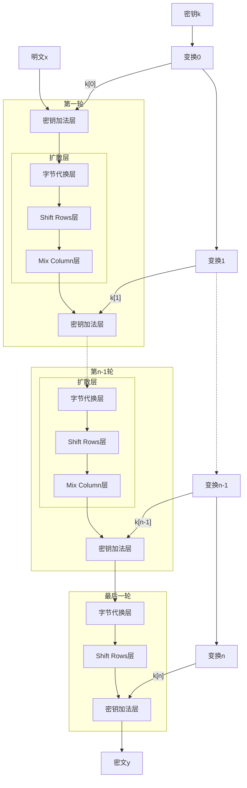

# AES加密算法

## 1 参考文章

参考书籍：《图解密码技术》

参考博客： [AES算法详解 - 沉舟侧畔 - 博客园](https://www.cnblogs.com/chenshikun/p/11667438.html")

## 2 简介

:::info
AES是取代其前任标准（DES）而成为新标准的一种对称密码算法。全世界的企业和密码学家提交了多个对称密码算法作为AES的候选，最终在2000年从这些候选算法中选出了一种名为Rijndael的对称密码算法，并将其确定为了AES。

AES的全称是Advanced Encryption Standard，意思是高级加密标准。 AES密码分组大小和密钥大小可以为128位、192位和256位。然而AES只要求分组大小为128位。本文只对分组大小128位，密钥长度也为128位的Rijndael算法进行分析。密钥长度为192位和256位的处理方式和128位的处理方式类似，只不过密钥长度每增加64位，算法的循环次数就增加2轮，128位循环10轮、192位循环12轮、256位循环14轮。
:::

AES算法使用逻辑就是：发送方将要发送的明文数据X使用秘钥K进行AES加密后会得到密文Y，将密文进行网络传输，接受方在收到密文Y后使用秘钥K进行AES解密后技能得到明文X,这样即使密文Y在网络上传输时被截获了，没有秘钥也难以破解其真实意思



## 3 原理

AES算法主要有四种操作处理，分别是：

1. **密钥加法层**(也叫轮密钥加，英文Add Round Key)
2. **字节代换层**(SubByte)
3. **行位移层**(Shift Rows)
4. **列混淆层**(Mix Column)

接下来介绍的AES算法的处理流程（基于128位的密钥），这里不会介绍的很详细，了解大致概念即可

### 3.1 密钥加法层

将每组明文与密钥进行按字节异或操作就可以了


### 3.2 字节代换层

字节代换层的主要功能就是让输入的数据通过S_box表完成从一个字节到另一个字节的映射，这里的S_box表是通过某种方法计算出来的，具体的计算方法在此不做详述，我们只需要知道如何使用S_box表即可。S_box表是一个拥有256个字节元素的数组，可以将其定义为一维数组，也可以将其定义为16·16的二维数组，如果将其定义为二维数组，读取S_box数据的方法就是要将输入数据的每个字节的高四位作为第一个下标，低四位作为第二个下标，略有点麻烦。这里建议将其视作一维数组即可。逆S盒与S盒对应，用于解密时对数据处理，我们对解密时的程序处理称作逆字节代换，只是使用的代换表盒加密时不同而已。

下面是一个S盒与逆S盒的实例：

**S盒**

| 行号 \ 列号 |  0   |  1   |  2   |  3   |  4   |  5   |  6   |  7   |  8   |  9   |  10  |  11  |  12  |  13  |  14  |  15  |
| :-----: | :--: | :--: | :--: | :--: | :--: | :--: | :--: | :--: | :--: | :--: | :--: | :--: | :--: | :--: | :--: | :--: |
|  **0**  | 0x63 | 0x7C | 0x77 | 0x7B | 0xF2 | 0x6B | 0x6F | 0xC5 | 0x30 | 0x01 | 0x67 | 0x2B | 0xFE | 0xD7 | 0xAB | 0x76 |
|  **1**  | 0xCA | 0x82 | 0xC9 | 0x7D | 0xFA | 0x59 | 0x47 | 0xF0 | 0xAD | 0xD4 | 0xA2 | 0xAF | 0x9C | 0xA4 | 0x72 | 0xC0 |
|  **2**  | 0xB7 | 0xFD | 0x93 | 0x26 | 0x36 | 0x3F | 0xF7 | 0xCC | 0x34 | 0xA5 | 0xE5 | 0xF1 | 0x71 | 0xD8 | 0x31 | 0x15 |
|  **3**  | 0x04 | 0xC7 | 0x23 | 0xC3 | 0x18 | 0x96 | 0x05 | 0x9A | 0x07 | 0x12 | 0x80 | 0xE2 | 0xEB | 0x27 | 0xB2 | 0x75 |
|  **4**  | 0x09 | 0x83 | 0x2C | 0x1A | 0x1B | 0x6E | 0x5A | 0xA0 | 0x52 | 0x3B | 0xD6 | 0xB3 | 0x29 | 0xE3 | 0x2F | 0x84 |
|  **5**  | 0x53 | 0xD1 | 0x00 | 0xED | 0x20 | 0xFC | 0xB1 | 0x5B | 0x6A | 0xCB | 0xBE | 0x39 | 0x4A | 0x4C | 0x58 | 0xCF |
|  **6**  | 0xD0 | 0xEF | 0xAA | 0xFB | 0x43 | 0x4D | 0x33 | 0x85 | 0x45 | 0xF9 | 0x02 | 0x7F | 0x50 | 0x3C | 0x9F | 0xA8 |
|  **7**  | 0x51 | 0xA3 | 0x40 | 0x8F | 0x92 | 0x9D | 0x38 | 0xF5 | 0xBC | 0xB6 | 0xDA | 0x21 | 0x10 | 0xFF | 0xF3 | 0xD2 |
|  **8**  | 0xCD | 0x0C | 0x13 | 0xEC | 0x5F | 0x97 | 0x44 | 0x17 | 0xC4 | 0xA7 | 0x7E | 0x3D | 0x64 | 0x5D | 0x19 | 0x73 |
|  **9**  | 0x60 | 0x81 | 0x4F | 0xDC | 0x22 | 0x2A | 0x90 | 0x88 | 0x46 | 0xEE | 0xB8 | 0x14 | 0xDE | 0x5E | 0x0B | 0xDB |
| **10**  | 0xE0 | 0x32 | 0x3A | 0x0A | 0x49 | 0x06 | 0x24 | 0x5C | 0xC2 | 0xD3 | 0xAC | 0x62 | 0x91 | 0x95 | 0xE4 | 0x79 |
| **11**  | 0xE7 | 0xC8 | 0x37 | 0x6D | 0x8D | 0xD5 | 0x4E | 0xA9 | 0x6C | 0x56 | 0xF4 | 0xEA | 0x65 | 0x7A | 0xAE | 0x08 |
| **12**  | 0xBA | 0x78 | 0x25 | 0x2E | 0x1C | 0xA6 | 0xB4 | 0xC6 | 0xE8 | 0xDD | 0x74 | 0x1F | 0x4B | 0xBD | 0x8B | 0x8A |
| **13**  | 0x70 | 0x3E | 0xB5 | 0x66 | 0x48 | 0x03 | 0xF6 | 0x0E | 0x61 | 0x35 | 0x57 | 0xB9 | 0x86 | 0xC1 | 0x1D | 0x9E |
| **14**  | 0xE1 | 0xF8 | 0x98 | 0x11 | 0x69 | 0xD9 | 0x8E | 0x94 | 0x9B | 0x1E | 0x87 | 0xE9 | 0xCE | 0x55 | 0x28 | 0xDF |
| **15**  | 0x8C | 0xA1 | 0x89 | 0x0D | 0xBF | 0xE6 | 0x42 | 0x68 | 0x41 | 0x99 | 0x2D | 0x0F | 0xB0 | 0x54 | 0xBB | 0x16 |

**逆S盒**

| 行号 \ 列号 | 0 | 1 | 2 | 3 | 4 | 5 | 6 | 7 | 8 | 9 | 10 | 11 | 12 | 13 | 14 | 15 |
|:---:|:---:|:---:|:---:|:---:|:---:|:---:|:---:|:---:|:---:|:---:|:---:|:---:|:---:|:---:|:---:|:---:|
| **0** | 0x52 | 0x09 | 0x6A | 0xD5 | 0x30 | 0x36 | 0xA5 | 0x38 | 0xBF | 0x40 | 0xA3 | 0x9E | 0x81 | 0xF3 | 0xD7 | 0xFB |
| **1** | 0x7C | 0xE3 | 0x39 | 0x82 | 0x9B | 0x2F | 0xFF | 0x87 | 0x34 | 0x8E | 0x43 | 0x44 | 0xC4 | 0xDE | 0xE9 | 0xCB |
| **2** | 0x54 | 0x7B | 0x94 | 0x32 | 0xA6 | 0xC2 | 0x23 | 0x3D | 0xEE | 0x4C | 0x95 | 0x0B | 0x42 | 0xFA | 0xC3 | 0x4E |
| **3** | 0x08 | 0x2E | 0xA1 | 0x66 | 0x28 | 0xD9 | 0x24 | 0xB2 | 0x76 | 0x5B | 0xA2 | 0x49 | 0x6D | 0x8B | 0xD1 | 0x25 |
| **4** | 0x72 | 0xF8 | 0xF6 | 0x64 | 0x86 | 0x68 | 0x98 | 0x16 | 0xD4 | 0xA4 | 0x5C | 0xCC | 0x5D | 0x65 | 0xB6 | 0x92 |
| **5** | 0x6C | 0x70 | 0x48 | 0x50 | 0xFD | 0xED | 0xB9 | 0xDA | 0x5E | 0x15 | 0x46 | 0x57 | 0xA7 | 0x8D | 0x9D | 0x84 |
| **6** | 0x90 | 0xD8 | 0xAB | 0x00 | 0x8C | 0xBC | 0xD3 | 0x0A | 0xF7 | 0xE4 | 0x58 | 0x05 | 0xB8 | 0xB3 | 0x45 | 0x06 |
| **7** | 0xD0 | 0x2C | 0x1E | 0x8F | 0xCA | 0x3F | 0x0F | 0x02 | 0xC1 | 0xAF | 0xBD | 0x03 | 0x01 | 0x13 | 0x8A | 0x6B |
| **8** | 0x3A | 0x91 | 0x11 | 0x41 | 0x4F | 0x67 | 0xDC | 0xEA | 0x97 | 0xF2 | 0xCF | 0xCE | 0xF0 | 0xB4 | 0xE6 | 0x73 |
| **9** | 0x96 | 0xAC | 0x74 | 0x22 | 0xE7 | 0xAD | 0x35 | 0x85 | 0xE2 | 0xF9 | 0x37 | 0xE8 | 0x1C | 0x75 | 0xDF | 0x6E |
| **10** | 0x47 | 0xF1 | 0x1A | 0x71 | 0x1D | 0x29 | 0xC5 | 0x89 | 0x6F | 0xB7 | 0x62 | 0x0E | 0xAA | 0x18 | 0xBE | 0x1B |
| **11** | 0xFC | 0x56 | 0x3E | 0x4B | 0xC6 | 0xD2 | 0x79 | 0x20 | 0x9A | 0xDB | 0xC0 | 0xFE | 0x78 | 0xCD | 0x5A | 0xF4 |
| **12** | 0x1F | 0xDD | 0xA8 | 0x33 | 0x88 | 0x07 | 0xC7 | 0x31 | 0xB1 | 0x12 | 0x10 | 0x59 | 0x27 | 0x80 | 0xEC | 0x5F |
| **13** | 0x60 | 0x51 | 0x7F | 0xA9 | 0x19 | 0xB5 | 0x4A | 0x0D | 0x2D | 0xE5 | 0x7A | 0x9F | 0x93 | 0xC9 | 0x9C | 0xEF |
| **14** | 0xA0 | 0xE0 | 0x3B | 0x4D | 0xAE | 0x2A | 0xF5 | 0xB0 | 0xC8 | 0xEB | 0xBB | 0x3C | 0x83 | 0x53 | 0x99 | 0x61 |
| **15** | 0x17 | 0x2B | 0x04 | 0x7E | 0xBA | 0x77 | 0xD6 | 0x26 | 0xE1 | 0x69 | 0x14 | 0x63 | 0x55 | 0x21 | 0x0C | 0x7D |

加密图示：


### 3.3 行位移层

行位移操作最为简单，它是用来将输入数据作为一个4·4的字节矩阵进行处理的，然后将这个矩阵的字节进行位置上的置换。ShiftRows子层属于AES手动的扩散层，目的是将单个位上的变换扩散到影响整个状态行，从而达到雪崩效应。在加密时行位移处理与解密时的处理相反，我们这里将解密时的处理称作逆行位移。它之所以称作行位移，是因为它只在4·4矩阵的行间进行操作，每行4字节的数据。

加密时：保持矩阵的第一行不变，第二行向左移动8Bit(一个字节)、第三行向左移动2个字节、第四行向左移动3个字节。

解密时：保持矩阵的第一行不变，第二行向右移动8Bit(一个字节)、第三行向右移动2个字节、第四行向右移动3个字节。

正向行位移图解:


逆向行位移图解:


### 3.4 列混淆层

这一步是对一个4字节的值进行比特运算，将其变为另一个4字节的值。下图为对其中一列进行处理的情形：


### 3.5 AES处理流程图

在Rijndael的加密过程中，每一轮所进行的处理为：

- 字节代换层
- 行位移层
- 列混淆层
- 密钥加法层

总体流程如下图所示：


## 4 使用示例

```bash
jw@jwdesktop [16:47:20] [~/test] 
-> % openssl enc -aes-256-cbc -salt -in test_aes.txt -out test_aes.enc -pass pass:hello_aes -p
*** WARNING : deprecated key derivation used.
Using -iter or -pbkdf2 would be better.
salt=76EE7D25EB959C08
key=C4DBD38C1077733D7BE5322EAC3DD4827B40E32A6618B91FC2CC4262C9ED9F47
iv =83391636B3BFD90DF4F03B516FD9DDF4

jw@jwdesktop [16:48:09] [~/test] 
-> % openssl enc -d -aes-256-cbc -in test_aes.enc
enter AES-256-CBC decryption password:
*** WARNING : deprecated key derivation used.
Using -iter or -pbkdf2 would be better.
feaggrigofgijordjgregii
```
