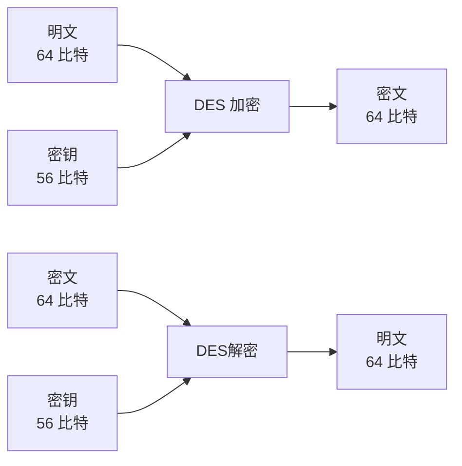

# DES加密算法

## 1 什么是DES

DES（Data Encryption standard）是1977年美国联邦信息处理标准（FIPS）中所采用的一种对称密码（FIPS 46-3）。DES一直以来被美国以及其他国家的政府和银行等广泛使用

然而，随着计算机的进步，现在DES已经能够被暴力破解，强度大不如前了。由于DES的密文可以在短时间内被破译，因此除了用它来解密以前的密文以外，现在我们不应该再使用DES了

## 2 加密与解密

DES是一种将64比特的明文加密成64比特的密文的对称密码算法，它的密钥长度是56比特。尽管从规格上来说，DES的密钥长度是64比特，但由于每隔7比特会设置一个用于错误检查的比特，因此实质上其密钥长度是56比特。

DES是以64比特的明文（比特序列）为一个单位来进行加密的，这个64比特的单位称为**分组**

## 3 DES的结构（Feistel网络）

:::info
DES的基本结构是由Horst Feistel设计的，因此也被称为 **Feistel网络**（Feistel network）、 **Feistel结构**（Feistel structure）、或者 **Feistel密码**（Feistel cipher）
:::

在Feistel网络中，加密的各个步骤称为 **轮**（round），整个加密过程就是若干次轮的循环，DES是一种16轮循环的Feistel网络

下图展示了Feistel网络中的一轮：

上面的两个方框表示Feistel网络中一轮的输入（明文）。输入的数据被等分为左右两半分别进行处理。在图中，左半部分写作“左侧”，右半部分写作“右侧”

下面的两个方框表示本轮的输出（密文）。输出的左半部分写作“加密后的左侧”，右半部分写作“右侧”

中间的“子密钥”指的是本轮加密所使用的密钥。在Feistel网络中，每一轮都需要使用一个不同的子密钥。由于子密钥只在一轮中使用，它只是一个局部密钥，因此才称为子密钥

总结一下，一轮的具体计算步骤如下：

1. 将输入的数据等分为左右两部分
2. 将输入的右侧直接发送到输出的右侧
3. 将输入的右侧发送到轮函数
4. 轮函数根据右侧数据和子密钥，计算出一串看上去是随机的比特序列
5. 将上一步得到的比特序列与左侧数据进行XOR运算，并将结果作为加密后的左侧

但是，这样一来“右侧”根本没有被加密，因此需要用不同的子密钥对一轮的处理重复若干次，并在每两轮处理之间将左侧和右侧的数据对调

下图展示了一个3轮的Feistel网络：

解密过程就是加密过程的重复：

## 4 三重DES

:::info
现在DES已经可以在现实的时间内被暴力破解，因此我们需要一种用来替代DES的分组密码，三重DES就是出于这个目的被开发出来的
三重DES（triple-DES）是为了增加DES的强度，将DES重复3次所得到的一种密码算法，也称为TDEA（Triple Date Encryption Algorithm），通常缩写为 **3DES**
:::

三重DES的加密机制如下图所示：

三重DES的解密机制如下图所示：

需要注意的是：

1. 当三重DES中所有的密钥都相同时，三重DES也就等同于普通的DES了
2. 当密钥1和密钥3使用相同的密钥，而密钥2使用不同的密钥，这种三重DES就称为DES-EDE2。EDE表示加密→解密→加密的这个流程
3. 当三个密钥都不同时，就称为DES-EDE3